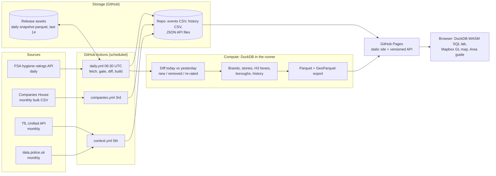

# London Pulse: architecture

A serverless, git-native data product. No servers, no database to run, no cloud bill. GitHub Actions is the
scheduler and compute, GitHub (repo, release assets, Pages) is storage and serving, and the user's browser does the
interactive analytics.

## End-to-end flow

## Daily run (06:30 UTC)

1. **Fetch** every establishment for the 33 London boroughs from the FSA API (retries, paging).
2. **Quality gate.** Refuse to publish if fewer than 70,000 rows, or if the row count moved more than 10% in a day.
   A bad fetch fails the job and yesterday's site stays live.
3. **Diff** against the previous snapshot (downloaded from the `snapshots` release): new, removed and re-rated
   premises, with coordinates, written to `data/events/YYYY-MM-DD.csv`.
4. **History**: one row per borough per day appended to `data/history.csv`.
5. **Model** in DuckDB: summary, borough table, "what the data says" stories, brand tracker, H3 hexagons
   (spatial and h3 extensions), venues for the map.
6. **Publish** JSON under `site/api/v1/`, Parquet and GeoParquet for the browser and for analysts.
7. **Store** today's snapshot as a release asset (last 14 kept), commit the small outputs, deploy to Pages.

## Monthly runs

- **Companies House (3rd):** bulk company file, filtered to coffee roasting, brewing, distilling and pub SIC codes in
  London postcode districts. A leading signal of openings, months before an FSA registration.
- **Area context (5th):** TfL stations and lines, plus police-recorded crime aggregated to a 0.005 degree grid.
  Counts only, no individual incidents.

## Serving and analytics

- **Static API.** Versioned (`/api/v1`), cacheable, and usable by any app. A service worker makes the site work offline.
- **SQL lab.** DuckDB-WASM loads the published Parquet in the browser. Users can run any SQL, use the no-SQL
  question builder, share a query as a link, download CSV, and see results as a chart. Nothing leaves their device.
- **Map.** Mapbox GL with 3D H3 hexagon layers (density, hygiene, new openings, coffee, specialty, chains, takeaways).
- **Area guide.** Postcode in, nearby venues, brands, stations and crime out, computed client side. Compare two areas.

## Design decisions an engineer will ask about

| Decision | Reason |
|---|---|
| Git and Pages instead of a database and API server | Zero ops and zero cost; the data is small (tens of MB) and read-heavy |
| Daily snapshots plus diffing, not CDC | The FSA offers no change feed, so day-over-day change is derived |
| DuckDB everywhere | One engine for pipeline SQL, spatial and H3 work, and in-browser analytics |
| Parquet and GeoParquet as the published contract | Columnar, typed, and loadable in QGIS, GeoPandas, DuckDB or a notebook |
| Quality gate before publish | A silent partial fetch is worse than a stale day |
| Snapshots in release assets, not in git | Keeps repo history small; 14 days is enough to recover |
| Best-effort optional stages (geo, crime) | An extension download failure must not block the core daily publish |
| Static JSON with a version prefix | Lets the schema evolve without breaking consumers |

## Data quality and limits

- About 18% of premises have no coordinates in the FSA data. They count in totals but cannot appear on the map.
- FHRS ids are issued per local authority, so ordering by id across boroughs is meaningless (this caused a real bug,
  now fixed with a per-borough list).
- "Removed from the register" is not "closed". Brand matching is by name. Hygiene ratings are not taste.
- Premises types are filtered to eating and drinking, including delivery-only kitchens ("Other catering premises").

## Tests and observability

- Unit tests cover diffing, the sanity gate and brand matching (`PYTHONPATH=src uv run pytest`).
- `status.json` records rows, previous rows, change counts and timestamps; the site shows a stale-data banner if the
  last run is more than two days old.

## Scaling path

1. Today: about 80k rows, a few MB of Parquet per day. Comfortable on GitHub for years.
2. If history grows: partition Parquet by month and query it from object storage (R2 or S3) with DuckDB httpfs.
3. If other cities are added: parameterise the borough list; keep one snapshot lake per city.
4. If it needs auth or write paths: add a thin API (Cloudflare Workers) over the same Parquet. The lake does not change.
