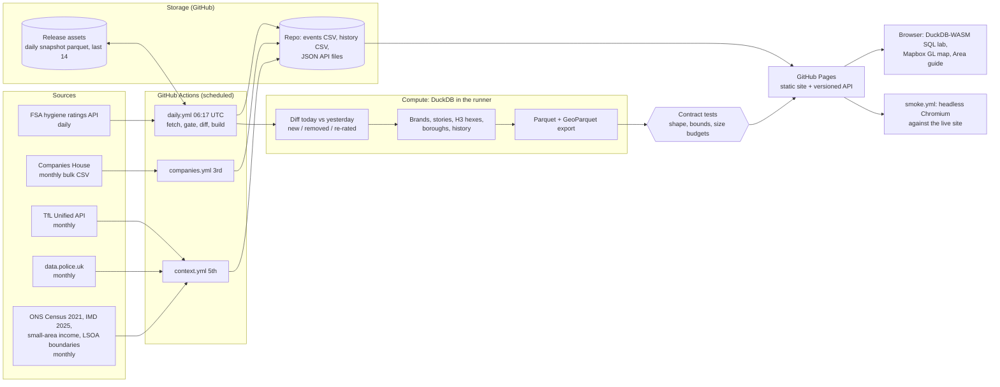

# London Pulse: architecture

A serverless, git-native data product. No servers, no database to run, no cloud bill. GitHub Actions is the
scheduler and compute, GitHub (repo, release assets, Pages) is storage and serving, and the user's browser does the
interactive analytics.

## End-to-end flow

## Daily run (06:17 UTC)

1. **Fetch** every establishment for the 33 London boroughs from the FSA API (retries, paging).
2. **Quality gate.** Refuse to publish if fewer than 70,000 rows, or if the row count moved more than 10% in a day.
   A bad fetch fails the job and yesterday's site stays live.
3. **Diff** against the previous snapshot (downloaded from the `snapshots` release): new, removed and re-rated
   premises, with coordinates, written to `data/events/YYYY-MM-DD.csv`.
4. **History**: one row per borough per day appended to `data/history.csv`.
5. **Geocode gaps.** About 18% of premises carry no coordinates. They are placed at the median of venues sharing
   their postcode, else their postcode sector. Premises with only a partial postcode (home caterers, where the FSA
   withholds the address) stay unplaced on purpose.
6. **Model** in DuckDB: summary, borough table, "what the data says" stories, brand tracker (curated roasters,
   breweries and chains plus auto-detected repeated names), H3 hexagons (spatial and h3 extensions) with density,
   hygiene, new-opening, coffee, specialty-coffee, chain-share and takeaway measures, and venues for the map.
   Eating and drinking includes "Other catering premises" (delivery-only kitchens).
6b. **Area character** (`character.py`): venue mix by name keywords, location quotients against London, a specialty-scene
   measure, share of premises awaiting first inspection, a stage per borough and postcode district, and generated headlines.
   Pace of change is only called once 14 days of snapshots exist.
7. **Publish** JSON under `site/api/v1/`, Parquet and GeoParquet for the browser and for analysts.
8. **Contract gate.** `tests/test_contract.py` checks every published file (shape, London bounds, known brands with
   plausible counts, size budgets). A failure stops the run before anything is committed or deployed.
9. **Store** today's snapshot as a release asset (last 14 kept), commit the small outputs, deploy to Pages.
10. **Smoke test.** `smoke.yml` runs after each successful deploy (see Tests).

## Monthly runs

- **Companies House (3rd):** bulk company file. `companies.py` filters it to coffee roasting, brewing, distilling and
  pub SIC codes in London postcode districts, a leading signal of openings months before an FSA registration.
  `operators.py` adds momentum (last 6 months against the 6 before) for food and drink, craft, creative, wellness,
  retail and tech, seasonality, mix shift and winding-down rates by district, and a profile of who is opening: new
  premises awaiting inspection are matched to a company by name within a postcode district, then labelled new entrant,
  young or established, and linked or standalone. The free file has no directors, so "first-time founder" is a likely
  label, not a fact. Mass-registration addresses are excluded.
- **Area context (5th):** TfL stations and lines, plus police-recorded crime aggregated to a 0.005 degree grid.
  Counts only, no individual incidents. `crime.py` also keeps the crime points in `work/` (not published). Then
  `neighbourhoods.py` joins crime points and FSA venues to LSOA boundaries, with Census 2021 tenure, IMD 2025 and ONS
  small-area income, into `areas.json`, and computes how crime varies with council share, with and without holding
  deprivation fixed. Reference downloads are cached in `work/reference` between runs. The contract test for `areas.json`
  runs before commit.

## Serving and analytics

- **Static API.** Versioned (`/api/v1`), cacheable, and usable by any app. A service worker makes the site work offline.
- **SQL lab.** DuckDB-WASM loads the published Parquet into in-memory tables in the browser. Users can run any SQL,
  use the no-SQL question builder, share a query as a link, download CSV, and see results as a chart (bars, or
  columns for dates). Shared links fill the box but never run on their own. Once the tables are loaded, external file
  access and extension loading are switched off, so visitor SQL cannot read other sites. Results are capped.
- **Map.** Mapbox GL (loaded with SRI) with a dots and heatmap view and 3D H3 hexagon layers (density, hygiene, new
  openings, coffee, specialty, chains, takeaways). A collapsible filters panel and a "ring latest changes" overlay.
- **Area guide.** Postcode in, nearby venues, brands, stations (nearest by Tube, Overground, Elizabeth line, DLR,
  National Rail, with walk times and line counts) and crime out, computed client side. Crime is compared with the
  London average per category and overall. Two areas can be compared side by side.

## Design decisions an engineer will ask about

| Decision | Reason |
|---|---|
| Git and Pages instead of a database and API server | Zero ops and zero cost; the data is small (tens of MB) and read-heavy |
| Daily snapshots plus diffing, not CDC | The FSA offers no change feed, so day-over-day change is derived |
| DuckDB everywhere | One engine for pipeline SQL, spatial and H3 work, and in-browser analytics |
| Parquet and GeoParquet as the published contract | Columnar, typed, and loadable in QGIS, GeoPandas, DuckDB or a notebook |
| Quality gate before publish | A silent partial fetch is worse than a stale day |
| Snapshots in release assets, not in git | Keeps repo history small; 14 days is enough to recover |
| Contract tests as a publish gate | The row-count gate catches a partial fetch; the contract catches a schema or coverage regression |
| Smoke test after deploy | Static sites fail at the browser, not the server; a headless run catches broken tabs, the SQL lab and the map |
| Tables in memory, then lock DuckDB config | Shared SQL links are untrusted input; locking after load stops network reads and extension installs |
| Best-effort optional stages (geo, crime) | An extension download failure must not block the core daily publish |
| Static JSON with a version prefix | Lets the schema evolve without breaking consumers |

## Data quality and limits

- About 18% of premises have no coordinates in the FSA data. About 2,650 are recovered from their postcode; about
  6,200 (mostly home-based caterers with a partial postcode) stay unplaced and appear only in totals and search.
  Postcode-placed venues are approximate to the postcode, not the doorstep.
- FHRS ids are issued per local authority, so ordering by id across boroughs is meaningless (this caused a real bug,
  now fixed with a per-borough list).
- "Removed from the register" is not "closed". Brand matching is by name. Hygiene ratings are not taste.
- Premises types are filtered to eating and drinking, including delivery-only kitchens ("Other catering premises").
- Crime is compared with an average populated 500 m grid square of London. Busy centres record far more than quiet
  streets, so the page says to compare like with like.

## Tests and observability

- **Unit tests** cover diffing, the sanity gate and brand matching (`PYTHONPATH=src uv run pytest`).
- **Data contract** (`tests/test_contract.py`) runs in the daily workflow before commit and deploy.
- **Smoke test** (`tests/smoke`, Playwright and Chromium) runs after every deploy via `smoke.yml`, and by hand with
  `SMOKE_URL=https://cloudcruncher.github.io/london-pulse/ uv run pytest tests/smoke`. It checks every tab, the Area
  guide and compare, the SQL lab (shared link does not auto-run, outside reads refused, chart renders), the Mapbox
  map, and no sideways scroll on a phone.
- `status.json` records rows, previous rows, change counts and timestamps; the site shows a stale-data banner if the
  last run is more than two days old. A failed Action emails the repository owner.

## Security posture

Reviewed by an independent security pass. Controls in place:

- No secrets in git. The Mapbox token is a public `pk.` token, URL-restricted in the Mapbox dashboard, injected at
  deploy from an environment secret, and the deploy refuses any token that is not `pk.`.
- All third-party data is escaped before it reaches the DOM, including Mapbox popups.
- GitHub Actions are pinned to commit SHAs (and the repo enforces it), jobs have least-privilege permissions, and
  `uv run --locked` pins Python dependencies. Workflows trigger only on schedule or manually.
- The SQL lab is locked down as described above; the Mapbox script and CSS carry integrity hashes; the service worker
  only manages its own `lp-` caches.

Known gaps, accepted for now: no Content Security Policy (it breaks DuckDB-WASM's worker and needs DuckDB
self-hosted first), DuckDB code loads from jsDelivr without an integrity hash, and the workflow token is job-wide.
Revisit these if traffic grows or logins are added; moving the site to its own domain would also separate it from the
portfolio origin.

## Scaling path

1. Today: about 80k rows, a few MB of Parquet per day. Comfortable on GitHub for years.
2. If history grows: partition Parquet by month and query it from object storage (R2 or S3) with DuckDB httpfs.
3. If other cities are added: parameterise the borough list; keep one snapshot lake per city.
4. If it needs auth or write paths: add a thin API (Cloudflare Workers) over the same Parquet. The lake does not change.
